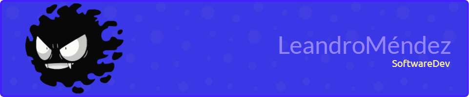

<h2 align="left">Software Developer from Argentina 🟦⬜🟦</h2>

<h5> I occasionally write articles here </h5> 

<h5> I’m currently learning   and cool stuff about infrastructure and DevOps. </h5> 

<h3>Where to find me</h3>

  

  
 

  

My DMs are always open.

  <h2>My Skills Include </h2> 
  
  <h3 >Backend</h3>
   
  
  
  
  
  
  
  
  
    
<h3 >Frontend</h3>

  
  
  
  
  
  
 
<h3 >Testing</h3>

  
  
  
 
<h3 >Infrastructure</h3>

  
  
  
  
  
  
   
   
   
  
  

<h3 >Tools and Tech</h3>

  
  
  
  
  
  
  
  
 

